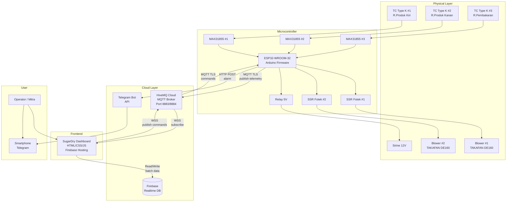

# 📋 SugarDry IoT Dashboard — Planning & Setup Roadmap

> **Project:** Coconut Sugar Dryer IoT — UNSOED × Central Agro Lestari  
> **Owner:** Muhammad Nur Bijak Bestari  
> **Date:** 25 April 2026

---

## 1. Audit Status Saat Ini

### ✅ Yang Sudah Selesai

| Komponen | Status | Detail |
|---|---|---|
| **UI Dashboard (HTML/CSS/JS)** | ✅ Done | 4 halaman: Monitoring, Pre-Batch, Post-Batch, Daftar Mesin |
| **Chart Real-time (Chart.js)** | ✅ Done | Grafik 3 zona suhu, range selector 5/15/30/60 menit |
| **Form Pre-Batch** | ✅ Done | MC awal, berat, mode blower, operator, dll |
| **Form Post-Batch** | ✅ Done | MC akhir, berat mesh/brontol, kalkulasi otomatis |
| **Registrasi Mesin** | ✅ Done | Tabel + form tambah mesin baru |
| **Alarm Log UI** | ✅ Done | Tampilan alarm real-time di dashboard |
| **Blower Status UI** | ✅ Done | Status ON/OFF, mode, duty cycle |
| **Wiring Diagram** | ✅ Done | Lengkap dengan analisis detail |
| **DFD (Level 0, 1, 2)** | ✅ Done | Data Flow Diagram lengkap |
| **ERD** | ✅ Done | 5 entitas: Operator, Mesin, Batch, Telemetri, Alarm |
| **Context Document** | ✅ Done | Scope, BOM, pin assignment, checklist |

### ❌ Yang Belum Dikerjakan

| Komponen | Prioritas | Effort |
|---|---|---|
| **Firebase Realtime Database setup** | 🔴 Tinggi | ~2 jam |
| **HiveMQ Cloud broker setup** | 🔴 Tinggi | ~1 jam |
| **MQTT.js (WebSocket) di dashboard** | 🔴 Tinggi | ~3 jam |
| **Firebase persistence (simpan batch data)** | 🔴 Tinggi | ~4 jam |
| **ESP32 Firmware (Arduino)** | 🔴 Tinggi | ~8-12 jam |
| **Telegram Bot setup** | 🟡 Sedang | ~2 jam |
| **Hosting (Vercel/Netlify/Firebase Hosting)** | 🟡 Sedang | ~1 jam |
| **Riwayat Batch (halaman histori)** | 🟡 Sedang | ~3 jam |
| **Dark Mode toggle** | 🟢 Rendah | ~2 jam |
| **PWA (Progressive Web App)** | 🟢 Rendah | ~2 jam |

---

## 2. Setup Firebase Realtime Database

### 2.1 Buat Firebase Project

1. Buka [Firebase Console](https://console.firebase.google.com/)
2. Klik **"Add Project"** → Nama: `sugardry-iot`
3. Disable Google Analytics (opsional untuk tahap ini)
4. Tunggu project selesai dibuat

### 2.2 Aktifkan Realtime Database

1. Di sidebar Firebase Console → **Build** → **Realtime Database**
2. Klik **"Create Database"**
3. Pilih region: **Singapore (asia-southeast1)** ← terdekat dari Indonesia
4. Mulai dengan **Test Mode** dulu (bisa diperketat nanti)

### 2.3 Struktur Database yang Direncanakan

Berdasarkan ERD yang sudah dibuat:

```json
{
  "machines": {
    "dryer01": {
      "name": "Dryer 01",
      "capacity_kg": 400,
      "vol_burner": "45 × 110 × 60",
      "vol_product": "90 × 108.5 × 177",
      "rpm_blower": 2800,
      "status": "active"
    }
  },
  "operators": {
    "op001": {
      "name": "Pak Ahmad",
      "contact": "08123456789"
    }
  },
  "batches": {
    "B202604250001": {
      "machine_id": "dryer01",
      "operator_id": "op001",
      "start_time": "2026-04-25T08:00:00+07:00",
      "end_time": null,
      "pre_batch": {
        "mc_awal": 3.5,
        "berat_awal_kg": 400,
        "jml_kompor": 2,
        "tipe_gas_kg": 12,
        "mode_blower": "Efisien",
        "durasi_rencana_mnt": 360
      },
      "post_batch": null,
      "status": "active"
    }
  },
  "telemetry": {
    "dryer01": {
      "latest": {
        "suhu_produk_kiri": 72.3,
        "suhu_produk_kanan": 70.8,
        "suhu_pembakaran": 155.2,
        "blower1": true,
        "blower2": true,
        "timestamp": 1745532000000
      }
    }
  },
  "alarms": {
    "dryer01": {
      "-Nxyz123": {
        "batch_id": "B202604250001",
        "type": "KOMPOR_MATI",
        "message": "Suhu pembakaran turun drastis",
        "timestamp": 1745535600000
      }
    }
  }
}
```

### 2.4 Security Rules (Production)

```json
{
  "rules": {
    "machines": {
      ".read": true,
      ".write": "auth != null"
    },
    "telemetry": {
      ".read": true,
      "$machine": {
        "latest": {
          ".write": true
        }
      }
    },
    "batches": {
      ".read": "auth != null",
      ".write": "auth != null"
    },
    "alarms": {
      ".read": true,
      ".write": true
    }
  }
}
```

### 2.5 Integrasi ke Dashboard (JavaScript)

Tambahkan di `index.html` sebelum `app.js`:

```html
<!-- Firebase SDK -->
<script src="https://www.gstatic.com/firebasejs/10.12.0/firebase-app-compat.js"></script>
<script src="https://www.gstatic.com/firebasejs/10.12.0/firebase-database-compat.js"></script>
<script>
  const firebaseConfig = {
    apiKey: "YOUR_API_KEY",
    authDomain: "sugardry-iot.firebaseapp.com",
    databaseURL: "https://sugardry-iot-default-rtdb.asia-southeast1.firebasedatabase.app",
    projectId: "sugardry-iot",
    storageBucket: "sugardry-iot.appspot.com",
    messagingSenderId: "YOUR_SENDER_ID",
    appId: "YOUR_APP_ID"
  };
  firebase.initializeApp(firebaseConfig);
  const db = firebase.database();
</script>
```

Contoh listener realtime di `app.js`:

```javascript
// Listen to telemetry updates from ESP32
function initFirebaseListeners() {
  const telRef = db.ref('telemetry/dryer01/latest');
  
  telRef.on('value', (snapshot) => {
    const data = snapshot.val();
    if (!data) return;
    
    state.temperatures.left = data.suhu_produk_kiri;
    state.temperatures.right = data.suhu_produk_kanan;
    state.temperatures.burner = data.suhu_pembakaran;
    state.blower1 = data.blower1;
    state.blower2 = data.blower2;
    
    updateTemperatureDisplay();
    updateBlowerDisplay();
  });
}

// Save batch data to Firebase
function saveBatchToFirebase(batchData) {
  const batchRef = db.ref(`batches/${batchData.id}`);
  return batchRef.set(batchData);
}
```

---

## 3. Setup HiveMQ Cloud (MQTT Broker)

### 3.1 Buat Akun & Cluster

1. Buka [HiveMQ Cloud](https://www.hivemq.com/cloud/)
2. **Sign Up** → pakai akun Google/email
3. Klik **"Create New Cluster"** → pilih **Free** (Serverless)
4. Region: Pilih yang terdekat (biasanya EU, tapi free tier terbatas)
5. Setelah cluster aktif, catat:
   - **Cluster URL**: `xxxxxxxx.s1.eu.hivemq.cloud` (contoh)
   - **Port MQTT**: `8883` (TLS)
   - **Port WebSocket**: `8884` (WSS)

### 3.2 Buat Credentials

1. Di dashboard HiveMQ → **Access Management**
2. Buat user baru:
   - **Username**: `sugardry-esp32`
   - **Password**: (buat password kuat)
   - **Permissions**: Publish & Subscribe ke semua topics
3. Buat user kedua untuk dashboard:
   - **Username**: `sugardry-dashboard`
   - **Password**: (buat password berbeda)
   - **Permissions**: Subscribe semua + Publish ke `oven/batch/*`

### 3.3 MQTT Topics (sesuai context doc)

```
oven/suhu/produk_kiri      → float °C        (ESP32 → Dashboard)
oven/suhu/produk_kanan     → float °C        (ESP32 → Dashboard)
oven/suhu/pembakaran       → float °C        (ESP32 → Dashboard)
oven/blower/status         → "ON" / "OFF"    (ESP32 → Dashboard)
oven/blower/mode           → str             (Dashboard → ESP32)
oven/blower/duty_cycle     → "ON_X_OFF_Y"    (ESP32 → Dashboard)
oven/alarm/status          → str             (ESP32 → Dashboard)
oven/batch/input           → JSON            (Dashboard → ESP32)
oven/batch/result          → JSON            (ESP32 → Dashboard)
```

### 3.4 Integrasi MQTT.js di Dashboard

Tambahkan di `index.html`:

```html
<!-- MQTT.js via CDN -->
<script src="https://unpkg.com/mqtt/dist/mqtt.min.js"></script>
```

Tambahkan MQTT manager di `app.js`:

```javascript
// ===== MQTT =====
const MQTT_CONFIG = {
  broker: 'wss://YOUR_CLUSTER.s1.eu.hivemq.cloud:8884/mqtt',
  username: 'sugardry-dashboard',
  password: 'YOUR_PASSWORD',
  clientId: `sugardry-dash-${Math.random().toString(16).slice(2, 8)}`,
};

let mqttClient = null;

function initMQTT() {
  mqttClient = mqtt.connect(MQTT_CONFIG.broker, {
    username: MQTT_CONFIG.username,
    password: MQTT_CONFIG.password,
    clientId: MQTT_CONFIG.clientId,
    clean: true,
    reconnectPeriod: 5000,
  });

  mqttClient.on('connect', () => {
    console.log('✅ MQTT Connected');
    updateMQTTStatus(true);
    
    // Subscribe to all oven topics
    mqttClient.subscribe('oven/#', (err) => {
      if (!err) console.log('📡 Subscribed to oven/#');
    });
  });

  mqttClient.on('message', (topic, message) => {
    const payload = message.toString();
    handleMQTTMessage(topic, payload);
  });

  mqttClient.on('error', (err) => {
    console.error('❌ MQTT Error:', err);
    updateMQTTStatus(false);
  });

  mqttClient.on('offline', () => {
    updateMQTTStatus(false);
  });
}

function handleMQTTMessage(topic, payload) {
  switch (topic) {
    case 'oven/suhu/produk_kiri':
      state.temperatures.left = parseFloat(payload);
      break;
    case 'oven/suhu/produk_kanan':
      state.temperatures.right = parseFloat(payload);
      break;
    case 'oven/suhu/pembakaran':
      state.temperatures.burner = parseFloat(payload);
      break;
    case 'oven/blower/status':
      const blowerOn = payload === 'ON';
      state.blower1 = blowerOn;
      state.blower2 = blowerOn;
      break;
    case 'oven/blower/mode':
      state.blowerMode = payload;
      break;
    case 'oven/alarm/status':
      if (payload !== 'NORMAL') {
        addAlarm('danger', `⚠️ Alarm: ${payload}`);
      }
      break;
    case 'oven/batch/result':
      try {
        const result = JSON.parse(payload);
        // Auto-fill post-batch form
        console.log('📊 Batch result received:', result);
      } catch (e) {}
      break;
  }
  
  updateTemperatureDisplay();
  updateBlowerDisplay();
}

function updateMQTTStatus(connected) {
  const dot = $('#mqttStatus');
  const text = $('#mqttStatusText');
  if (connected) {
    dot.className = 'status-dot connected';
    text.textContent = 'MQTT Terhubung';
  } else {
    dot.className = 'status-dot disconnected';
    text.textContent = 'MQTT Terputus';
  }
}

// Publish command to ESP32 (e.g., change blower mode)
function publishCommand(topic, payload) {
  if (mqttClient && mqttClient.connected) {
    mqttClient.publish(topic, payload);
  }
}
```

---

## 4. Setup ESP32 Firmware (Arduino IDE)

### 4.1 Libraries yang Dibutuhkan

```
- WiFi.h           (built-in ESP32)
- PubSubClient.h   (MQTT client — by Nick O'Leary)
- WiFiClientSecure  (TLS support)
- MAX31855.h       (by Rob Tillaart)
- ArduinoJson.h    (JSON serialization)
```

### 4.2 Skeleton Firmware

```cpp
#include <WiFi.h>
#include <WiFiClientSecure.h>
#include <PubSubClient.h>
#include "MAX31855.h"
#include <ArduinoJson.h>

// === WiFi ===
const char* WIFI_SSID = "NamaWiFi_Mitra";
const char* WIFI_PASS = "PasswordWiFi";

// === HiveMQ ===
const char* MQTT_SERVER = "YOUR_CLUSTER.s1.eu.hivemq.cloud";
const int   MQTT_PORT   = 8883;
const char* MQTT_USER   = "sugardry-esp32";
const char* MQTT_PASS   = "YOUR_PASSWORD";

// === Pins ===
#define CS_LEFT   5
#define CS_RIGHT  17
#define CS_BURNER 16
#define SCK_PIN   18
#define MISO_PIN  19
#define SSR1_PIN  32
#define SSR2_PIN  33
#define ALARM_PIN 25

// === Sensor ===
MAX31855 tcLeft(SCK_PIN, CS_LEFT, MISO_PIN);
MAX31855 tcRight(SCK_PIN, CS_RIGHT, MISO_PIN);
MAX31855 tcBurner(SCK_PIN, CS_BURNER, MISO_PIN);

// === MQTT ===
WiFiClientSecure espClient;
PubSubClient mqtt(espClient);

// === Timing (millis-based, NO delay!) ===
unsigned long lastPublish = 0;
const unsigned long PUBLISH_INTERVAL = 2000; // 2 detik

void setup() {
  Serial.begin(115200);
  
  // CRITICAL: Relay active LOW — set HIGH immediately!
  pinMode(ALARM_PIN, OUTPUT);
  digitalWrite(ALARM_PIN, HIGH);
  
  pinMode(SSR1_PIN, OUTPUT);
  pinMode(SSR2_PIN, OUTPUT);
  digitalWrite(SSR1_PIN, LOW);
  digitalWrite(SSR2_PIN, LOW);
  
  // Init sensors
  tcLeft.begin();
  tcRight.begin();
  tcBurner.begin();
  
  // WiFi
  WiFi.begin(WIFI_SSID, WIFI_PASS);
  while (WiFi.status() != WL_CONNECTED) {
    delay(500);
    Serial.print(".");
  }
  Serial.println("\n✅ WiFi Connected");
  
  // MQTT (TLS)
  espClient.setInsecure(); // Skip cert verification (OK for HiveMQ Cloud)
  mqtt.setServer(MQTT_SERVER, MQTT_PORT);
  mqtt.setCallback(mqttCallback);
  
  reconnectMQTT();
}

void loop() {
  if (!mqtt.connected()) reconnectMQTT();
  mqtt.loop();
  
  if (millis() - lastPublish >= PUBLISH_INTERVAL) {
    lastPublish = millis();
    publishTelemetry();
  }
  
  // Blower scheduling here (millis-based)
  // Alarm detection here
}

void publishTelemetry() {
  float tLeft  = tcLeft.getTemperature();
  float tRight = tcRight.getTemperature();
  float tBurn  = tcBurner.getTemperature();
  
  char buf[10];
  dtostrf(tLeft, 4, 1, buf);  mqtt.publish("oven/suhu/produk_kiri", buf);
  dtostrf(tRight, 4, 1, buf); mqtt.publish("oven/suhu/produk_kanan", buf);
  dtostrf(tBurn, 4, 1, buf);  mqtt.publish("oven/suhu/pembakaran", buf);
  
  // Also push to Firebase via MQTT-Firebase bridge (or HTTP)
}

void mqttCallback(char* topic, byte* payload, unsigned int length) {
  // Handle commands from dashboard
  String msg;
  for (int i = 0; i < length; i++) msg += (char)payload[i];
  
  if (String(topic) == "oven/blower/mode") {
    // Change blower mode
    Serial.println("Mode changed to: " + msg);
  }
}

void reconnectMQTT() {
  while (!mqtt.connected()) {
    String clientId = "sugardry-esp32-" + String(random(0xffff), HEX);
    if (mqtt.connect(clientId.c_str(), MQTT_USER, MQTT_PASS)) {
      Serial.println("✅ MQTT Connected");
      mqtt.subscribe("oven/blower/mode");
      mqtt.subscribe("oven/batch/input");
    } else {
      Serial.print("❌ MQTT failed, rc=");
      Serial.println(mqtt.state());
      delay(5000);
    }
  }
}
```

---

## 5. Setup Telegram Bot (Notifikasi Alarm)

### 5.1 Buat Bot

1. Buka Telegram → cari **@BotFather**
2. Kirim `/newbot`
3. Nama: `SugarDry Alert Bot`
4. Username: `sugardry_alert_bot` (harus unik)
5. Catat **Bot Token**: `123456789:ABCdefGhIJKlmNOPqrsTUVwxYZ`

### 5.2 Dapatkan Chat ID

1. Start chat dengan bot Anda
2. Kirim pesan apa saja
3. Buka: `https://api.telegram.org/bot<TOKEN>/getUpdates`
4. Cari `"chat":{"id": 123456789}` → itu Chat ID Anda

### 5.3 Kirim Alert dari ESP32

```cpp
#include <HTTPClient.h>

const char* TELEGRAM_TOKEN = "YOUR_BOT_TOKEN";
const char* TELEGRAM_CHAT_ID = "YOUR_CHAT_ID";

void sendTelegramAlert(String message) {
  if (WiFi.status() != WL_CONNECTED) return;
  
  HTTPClient http;
  String url = "https://api.telegram.org/bot" + String(TELEGRAM_TOKEN) 
             + "/sendMessage?chat_id=" + String(TELEGRAM_CHAT_ID) 
             + "&text=" + message 
             + "&parse_mode=HTML";
  
  http.begin(url);
  int httpCode = http.GET();
  http.end();
  
  Serial.println("Telegram sent: " + String(httpCode));
}

// Contoh penggunaan:
// sendTelegramAlert("🔥 <b>ALARM!</b>\nKompor mati terdeteksi!\nSuhu pembakaran: 45°C");
```

---

## 6. Hosting Dashboard

### Opsi A: Firebase Hosting (Rekomendasi — sudah satu ekosistem)

```bash
# Install Firebase CLI
npm install -g firebase-tools

# Login
firebase login

# Init hosting
cd dashboard
firebase init hosting
# → Pilih project sugardry-iot
# → Public directory: ./
# → Single page app: No

# Deploy
firebase deploy --only hosting
```

### Opsi B: Vercel (Alternatif — lebih simpel)

1. Push dashboard ke GitHub
2. Buka [vercel.com](https://vercel.com) → Import repo
3. Deploy otomatis

### Opsi C: Netlify

1. Drag & drop folder `dashboard/` ke [netlify.com/drop](https://app.netlify.com/drop)
2. Langsung live

---

## 7. Prioritized Task Checklist

### 🔴 Phase 1: Backend Connection (Minggu Ini)

- [ ] Buat Firebase project + Realtime Database
- [ ] Setup HiveMQ Cloud cluster + credentials
- [ ] Integrasikan MQTT.js ke dashboard (ganti simulasi → data real MQTT)
- [ ] Integrasikan Firebase SDK ke dashboard (simpan batch data)
- [ ] Test koneksi MQTT via browser console

### 🟠 Phase 2: ESP32 Firmware (Minggu Depan)

- [ ] Setup Arduino IDE + board ESP32
- [ ] Install libraries (PubSubClient, MAX31855, ArduinoJson)
- [ ] Firmware: baca suhu 3 zona → publish MQTT
- [ ] Firmware: subscribe mode blower dari dashboard
- [ ] Firmware: blower scheduling (millis-based)
- [ ] Firmware: alarm detection dari penurunan suhu
- [ ] Test end-to-end: Sensor → ESP32 → HiveMQ → Dashboard

### 🟡 Phase 3: Full Features (Minggu Ke-3)

- [ ] Setup Telegram Bot + integrasikan ke ESP32
- [ ] Dashboard: halaman Riwayat Batch (baca dari Firebase)
- [ ] Dashboard: export data batch ke CSV
- [ ] Dashboard: switch antara mode simulasi ↔ live data
- [ ] Deploy dashboard ke Firebase Hosting / Vercel

### 🟢 Phase 4: Polish (Minggu Ke-4)

- [ ] Security rules Firebase (bukan test mode)
- [ ] Error handling & reconnect logic
- [ ] PWA manifest + service worker (offline access)
- [ ] User manual untuk operator
- [ ] Dokumentasi teknis untuk laporan capstone

---

## 8. Architecture Diagram (Final)



---

## 9. Credentials & Config Checklist

> [!CAUTION]
> Simpan semua credentials di tempat aman. JANGAN commit ke Git!

| Service | Yang Perlu Dicatat | Dimana Dipakai |
|---|---|---|
| **Firebase** | apiKey, databaseURL, projectId, appId | `index.html` (config block) |
| **HiveMQ** | Cluster URL, Port 8883/8884, Username, Password | `app.js` (MQTT config) + ESP32 firmware |
| **Telegram** | Bot Token, Chat ID | ESP32 firmware |
| **WiFi Mitra** | SSID, Password | ESP32 firmware |

> [!TIP]
> Untuk development, bisa buat file `config.js` yang di-`.gitignore`:
> ```javascript
> // config.js — JANGAN COMMIT!
> const CONFIG = {
>   firebase: { /* ... */ },
>   mqtt: { /* ... */ },
> };
> ```

---

## 10. Pertanyaan Keputusan yang Perlu Dijawab

1. **Firebase Auth**: Perlu login untuk operator, atau dashboard terbuka tanpa auth?
2. **Data retention**: Berapa lama data telemetri disimpan? (per detik × 6 jam = ~10.800 record per batch)
3. **Multi-machine**: Dashboard saat ini hardcode "Dryer 01" — perlu support multiple dryers langsung?
4. **Offline mode**: Jika WiFi mati di pabrik, ESP32 buffer data lokal dulu atau langsung hilang?
5. **MQTT vs Firebase langsung**: ESP32 publish ke HiveMQ → dashboard subscribe, ATAU ESP32 langsung write ke Firebase? (Rekomendasi: **MQTT untuk real-time, Firebase untuk persistence**)
