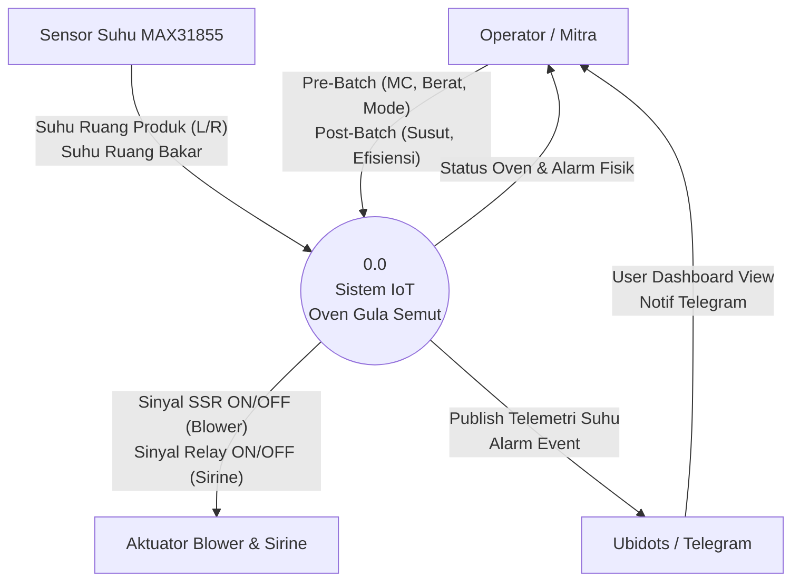
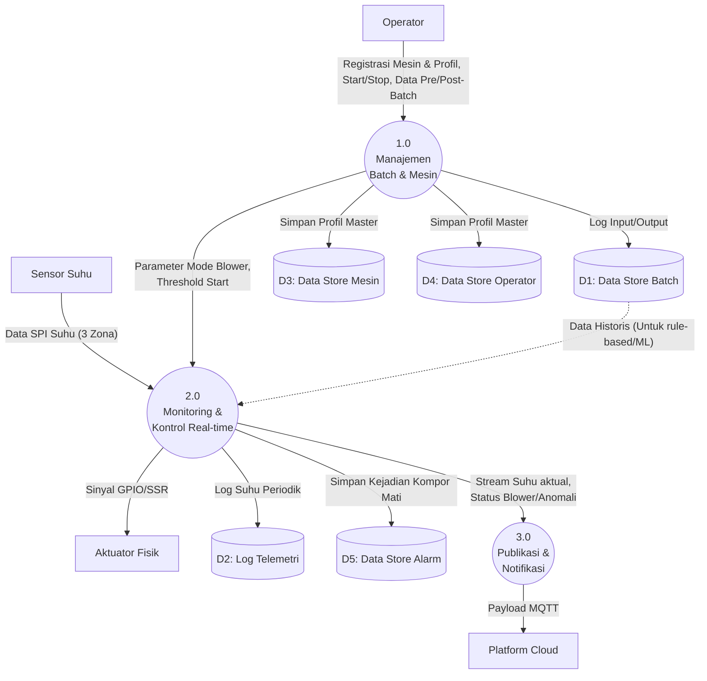
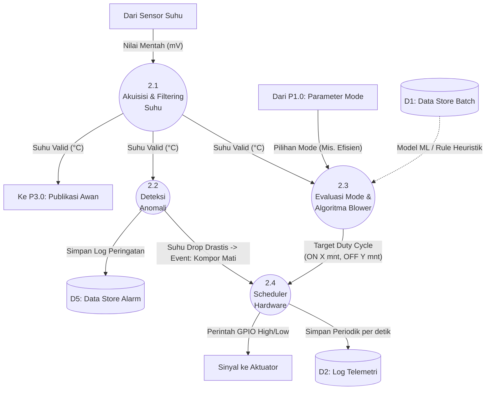

# Data Flow Diagram (DFD): Coconut Sugar Dryer IoT

Berikut ini adalah perbaikan simbol pada DFD:
- **Entitas Eksternal (External Entity):** Secara tegas menggunakan Kotak Siku `[ ]`.
- **Proses (Process):** Tetap menggunakan Lingkaran `(( ))`.
- **Data Store / Storage:** Menurut standar DFD (seperti yang dijelaskan di GeeksforGeeks), Data Store wajib menggunakan **Dua Garis Horizontal (Two Horizontal Lines)**. Namun, karena keterbatasan library visual Markdown (Mermaid.js) yang *tidak memiliki bentuk dua garis horizontal*, diagram disini direpresentasikan menggunakan **Silinder Database `[( )]`** sebagai storage. Saat Anda memindahkannya ke Visio atau Draw.io, pastikan Anda menggunakan simbol 2 garis horizontal!

---

## 1. DFD Level 0 (Context Diagram)

---

## 2. DFD Level 1 (Dekomposisi Sistem Utama)

---

## 3. DFD Level 2 (Breakdown Proses 2.0: Kontrol Real-time)

