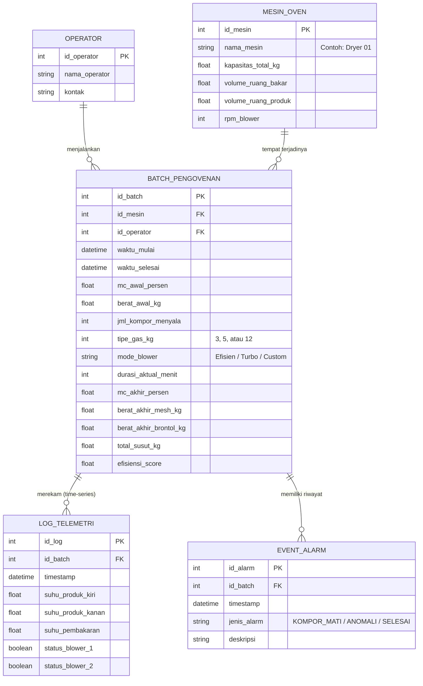

# Entity Relationship Diagram (ERD)

Berdasarkan *Data Flow Diagram* (terutama struktur data yang tertangkap pada D1 dan D2), berikut adalah model basis data relasional (ERD) yang menjabarkan entitas dan atribut untuk penyimpanan data cloud Anda. Struktur ini sangat optimal dipakai sebagai dasar perancangan *database* lokal (MySQL/PostgreSQL) maupun NoSQL yang memfasilitasi kebutuhan *Machine Learning* ke depannya.

---

### Penjelasan Relasi & Tabel:

1. **`MESIN_OVEN` (Master Data):** Menyimpan spesifikasi teknis alat. Atributnya merujuk ke parameter *Pre-Batch* dari dokumen excel mitra. Satu mesin bisa dipakai berulang kali untuk banyak batch (1 ke Banyak).
2. **`OPERATOR` (Master Data):** Karena input pre/post batch dilakukan oleh manusia, mencatat siapa yang bertugas bisa berguna untuk validitas data model ML nantinya.
3. **`BATCH_PENGOVENAN` (Transaksi Utama / D1):** Ini adalah jantung dari program. Tabel ini menggabungkan *input manual* sebelum masak, *input manual* sesudah masak, dan ringkasan performa yang diolah mesin. Dalam konteks Machine Learning, satu buah *row* di tabel `BATCH_PENGOVENAN` akan menjadi satu buah *row training data*.
4. **`LOG_TELEMETRI` (Time Series / D2):** Data yang *di-publish* oleh ESP32 setiap beberapa detik. Terhubung ke ID Batch agar saat Anda menganalisis performa pengeringan, Anda bisa merekonstruksi grafik fluktuasi suhunya dari awal sampai akhir sesi tersebut.
5. **`EVENT_ALARM`:** Terpisah dari log suhu agar *platform* gampang menghitung berapa kali oven mengalami *burn-out* (kompor mati) tanpa harus mencari di seluruh tabel telemetri yang masif.
