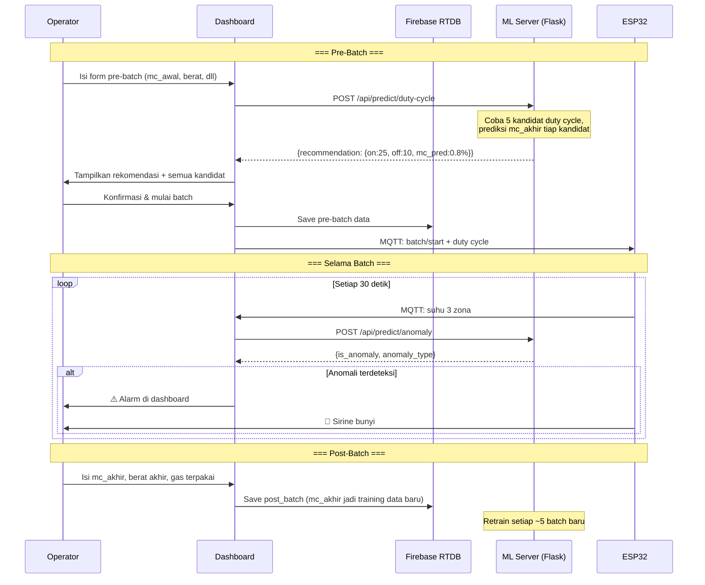

# 🤖 Machine Learning Implementation Plan — SugarDry IoT

> **Project:** Coconut Sugar Dryer IoT — UNSOED × Central Agro Lestari
> **Updated:** 1 Mei 2026
> **Prerequisite:** Dashboard ✅ selesai, Firebase + MQTT ⏳ dalam integrasi

---

## 1. Ringkasan: ML Apa yang Dipakai?

Ada **2 model ML** dalam sistem ini:

| # | Model | Algoritma | Tujuan | Kapan Aktif |
|---|-------|-----------|--------|-------------|
| **ML-1** | Blower Optimizer | **XGBoost Regressor** | Prediksi `mc_akhir` untuk tiap kandidat duty cycle, lalu pilih yang terbaik | Setelah ≥30 batch |
| **ML-2** | Anomaly Detector | **Isolation Forest** | Deteksi anomali suhu real-time (kompor mati, overheat) | Setelah ≥10 batch |

> [!IMPORTANT]
> **Kenapa XGBoost, bukan Neural Network?**
> - Data tabular (bukan gambar/teks) → XGBoost unggul untuk data kecil-menengah
> - Jumlah data terbatas (30–100 batch) → Neural Network butuh ribuan sampel
> - Interpretable → bisa dijelaskan ke dosen/mitra fitur mana yang paling berpengaruh
> - Ringan → jalan di laptop biasa, tidak butuh GPU

---

## 2. Penjelasan Sederhana untuk Mitra

### Analoginya: Buku Catatan Operator Senior

Bayangkan operator senior yang sudah 5 tahun kerja punya buku catatan berisi ratusan batch:

> *"MC masuk 3.5%, berat 400kg, blower ON 25 menit OFF 10 menit, suhu rata-rata 148°C → MC akhir 0.8% ✅"*
>
> *"MC masuk 4%, blower ON 20 menit saja → MC akhir 1.3% ❌ kurang kering"*

**Machine learning menggantikan insting itu dengan matematika** — belajar dari semua catatan termasuk yang gagal, lalu memberi rekomendasi untuk batch berikutnya.

### Alur Sederhana

```
Bulan 1-2:  Kumpulkan data  →  Operator masak seperti biasa (mode Custom/Turbo)
                                Semua data tersimpan otomatis di cloud

Bulan 3:    Training model  →  1x jalankan script Python, selesai

Setelahnya: Model aktif     →  Setiap mau masak, sistem rekomendasikan
                                duty cycle blower terbaik untuk kondisi hari itu
```

---

## 3. Data: Dari Mana, Apa Saja, Peran di Model

### 3.1 Sumber Data

```
Firebase Realtime Database
├── batches/{batchId}
│   ├── pre_batch     ← diisi operator lewat form dashboard (sebelum masak)
│   ├── post_batch    ← diisi operator lewat form dashboard (setelah masak)
│   └── summary       ← dihitung otomatis oleh dashboard
└── telemetry_logs/{batchId}
    └── {pushId}      ← dikirim ESP32 otomatis tiap 2 detik selama masak
```

### 3.2 Data Pre-Batch → Fitur Input (X)

Diisi operator **sebelum masak** lewat form dashboard:

| Kolom | Tipe | Contoh | Keterangan |
|-------|------|--------|------------|
| `mc_awal` | `float` % | `3.5` | Moisture content awal gula |
| `berat_awal_kg` | `float` kg | `400` | Berat muatan awal |
| `jml_kompor` | `int` | `2` | Kompor yang menyala |
| `tipe_gas_kg` | `int` | `12` | Ukuran tabung gas (3/5/12 kg) |
| `durasi_rencana_mnt` | `int` | `360` | Durasi yang direncanakan |

### 3.3 Data Telemetry → Fitur Input (X)

Dicatat **otomatis oleh ESP32** selama masak, lalu diagregasi per batch:

| Kolom | Tipe | Contoh | Keterangan |
|-------|------|--------|------------|
| `suhu_avg_bakar` | `float` °C | `148.3` | Rata-rata suhu R. Pembakaran |
| `suhu_avg_produk` | `float` °C | `71.2` | Rata-rata suhu R. Produk |
| `suhu_std_bakar` | `float` | `10.5` | Stabilitas suhu pembakaran |
| `suhu_std_produk` | `float` | `3.2` | Stabilitas suhu produk |
| `suhu_slope_bakar` | `float` | `-0.02` | Tren suhu (negatif = turun) |
| `blower_on_total_mnt` | `int` | `225` | Total menit blower ON |
| `blower_siklus` | `int` | `9` | Jumlah siklus ON-OFF |
| `durasi_aktual_mnt` | `int` | `315` | Durasi aktual batch |

### 3.4 Data Post-Batch → Target (y) ⭐

Diisi operator **setelah masak** — **inilah yang model pelajari dan prediksi**:

| Kolom | Tipe | Contoh | Peran di Model |
|-------|------|--------|----------------|
| `mc_akhir` | `float` % | `0.8` | ⭐ **TARGET UTAMA** — yang diprediksi XGBoost |
| `efisiensi_score` | `float` | `0.008` | Referensi tambahan (gas/kg produk) |
| `target_mc_tercapai` | `bool` | `True` | Info apakah batch berhasil |

> [!IMPORTANT]
> **Kenapa `mc_akhir` jadi target, bukan input?**
>
> Model dipanggil **sebelum masak dimulai** — saat itu `mc_akhir` belum ada.
> Model belajar dari catatan batch lama: *"kondisi + duty cycle ini → menghasilkan mc_akhir sekian"*.
> Lalu saat pre-batch baru, model mencoba beberapa opsi duty cycle dan memprediksi
> mana yang akan menghasilkan `mc_akhir < 1%`.

### 3.5 Ringkasan Peran Data

```
                    ┌─────────────────────────────────────────┐
SETIAP BATCH        │  INPUT (X) yang diketahui saat masak:   │
menghasilkan        │  mc_awal, berat, suhu, duty cycle, dll  │
1 ROW DATA          │                                         │
                    │         MODEL BELAJAR                    │
                    │         hubungannya dengan:             │
                    │                                         │
                    │  TARGET (y) yang diketahui setelah masak│
                    │  mc_akhir  ←  inilah yang diprediksi   │
                    └─────────────────────────────────────────┘

Batch GAGAL (mc_akhir ≥ 1%) tetap dipakai untuk training!
→ Mengajarkan model: "duty cycle ini tidak cukup untuk kondisi tersebut"
```

---

## 4. Cara Model Bekerja Saat Prediksi

Saat operator mengisi form pre-batch dan memilih mode **"Efisien"**:

```
Kondisi: mc_awal = 3.5%, berat = 400kg, 2 kompor

Dashboard tanya ke model 5 kandidat duty cycle:
┌─────────────────┬──────────────────────┬──────────────────┐
│ Kandidat        │ Prediksi mc_akhir    │ Status           │
├─────────────────┼──────────────────────┼──────────────────┤
│ ON 20 / OFF 10  │ 1.2%                 │ ❌ Kurang kering  │
│ ON 25 / OFF 10  │ 0.8%                 │ ✅ Cukup kering   │
│ ON 30 / OFF 10  │ 0.6%                 │ ✅ Cukup kering   │
│ ON 30 / OFF 5   │ 0.5%                 │ ✅ Cukup kering   │
│ Turbo (ON 100%) │ 0.3%                 │ ✅ Tapi boros     │
└─────────────────┴──────────────────────┴──────────────────┘

Sistem pilih: ON 25 / OFF 10
→ Yang paling hemat dari semua yang mc_akhir < 1%

Dashboard tampilkan ke operator:
"🤖 Rekomendasi ML: Blower ON 25 menit / OFF 10 menit
   Prediksi MC akhir: 0.8% (target < 1% ✅)"
```

---

## 5. Struktur File ML

```
Capstone/
├── dashboard/              ← sudah ada ✅
│   └── ml-service.js       ← connector dashboard ↔ Flask API ✅
├── hardware/               ← sudah ada ✅
└── ml/
    ├── data/
    │   └── batches_export.csv      ← hasil export dari Firebase
    ├── models/
    │   ├── blower_optimizer.joblib ← model XGBoost
    │   ├── anomaly_detector.joblib ← model Isolation Forest
    │   ├── label_encoder.joblib    ← encoder mode_blower
    │   └── model_metadata.json     ← info akurasi + feature importance
    ├── export_firebase.py          ← ambil data dari Firebase → CSV ✅
    ├── train_blower_model.py       ← training XGBoost (target: mc_akhir) ✅
    ├── train_anomaly_model.py      ← training Isolation Forest ✅
    ├── predict_server.py           ← Flask API server ✅
    └── requirements.txt            ✅
```

---

## 6. Alur Data End-to-End



---

## 7. Fase Implementasi

### Bulan 1–2 — Hardware + Data Collection (Prioritas Sekarang)

| Status | Task |
|--------|------|
| ⏳ | Wiring hardware: MCB, resistor 330Ω, RC snubber, heatsink SSR |
| ⏳ | Firmware ESP32: baca suhu → publish MQTT |
| ⏳ | Firebase + MQTT integration di dashboard |
| ⏳ | Test end-to-end: sensor → ESP32 → dashboard |
| 🎯 | **Target: kumpulkan ≥30 batch data lengkap** |

> [!NOTE]
> Selama Bulan 1-2, gunakan mode **Custom** atau **Turbo** untuk batch.
> Folder `ml/` tidak perlu dijalankan dulu — semua sudah siap, tinggal tunggu data.

### Bulan 3 — ML Training & Integration

| Minggu | Task |
|--------|------|
| 3-1 | `python export_firebase.py` → ekspor data, EDA di Jupyter |
| 3-2 | `python train_blower_model.py` + `train_anomaly_model.py` |
| 3-3 | `python predict_server.py` → deploy Flask, test dari dashboard |
| 3-4 | Testing end-to-end, dokumentasi laporan capstone |

---

## 8. Deployment ML Server

Model **tidak bisa langsung jalan di browser**. Dibutuhkan Flask server:

```
Dashboard (browser)
    → HTTP fetch()
        → Flask Server (Python, jalan di laptop/PC)
            → load .joblib model
            → return prediksi JSON
```

| Opsi | Dimana | Cocok Untuk |
|------|--------|-------------|
| **Laptop** | `localhost:5000` | Demo ke dosen / testing |
| **Render / Railway** | Cloud gratis | Dashboard online production |
| **PC di pabrik mitra** | LAN lokal | Jika pabrik punya PC menyala |

Untuk capstone, **laptop sendiri sudah cukup**.

---

## 9. Catatan untuk Laporan Capstone (DCP-300)

### Yang Ditulis di Bab Metodologi:

1. **Supervised Learning (XGBoost Regressor)**
   - Target: `mc_akhir` (moisture content akhir pengeringan)
   - Input: kondisi pre-batch + duty cycle blower yang digunakan
   - Semua batch dipakai termasuk yang gagal → model belajar batas kondisi
   - Inference: coba 5 kandidat duty cycle, pilih yang prediksi `mc_akhir < 1%`

2. **Unsupervised Learning (Isolation Forest)**
   - Deteksi anomali suhu real-time tanpa label manual
   - Hanya belajar dari pola "normal", otomatis flag yang menyimpang

3. **Feature Engineering**
   - Time-series telemetry ESP32 → fitur statistik (mean, std, slope) per batch

4. **Evaluasi: Leave-One-Out Cross-Validation**
   - Cocok untuk dataset kecil (< 100 sampel)

5. **Graceful Degradation**
   - Jika ML server tidak aktif → dashboard fallback ke rule-based heuristic

### Metrik Evaluasi Target:

| Model | Metrik | Target |
|-------|--------|--------|
| XGBoost | MAE `mc_akhir` | < 0.5% |
| XGBoost | R² Score | > 0.6 |
| Isolation Forest | Precision deteksi anomali | > 80% |
| Isolation Forest | False alarm rate | < 10% |
